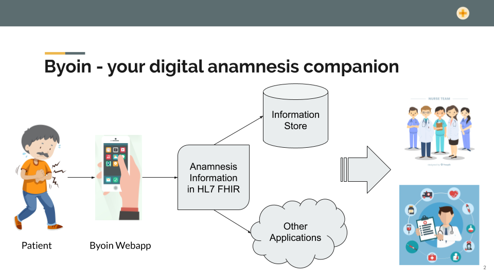

 
Byoin is a web application that offers patients the possibility to use their waiting time in a meaningful way. With this, it is possible to fill out some information about themselves and their condition. This information is transformed into the HL7 FHIR format and can be shared with the infrastructure of the hospital. 

## Implementation:
Platform Independence: It can be used on any machine with a modern web browser like Google Chrome, Mozilla Firefox or Chromium Edge 
Interoperability: The results are formatted in the HL7 FHIR format and can be used by any other application  
Camera Access: The camera access is already functional (front and back camera)  
Forms: Information about the patient and condition can already be filled out in the forms  
Computer Vision: Detection of location and type of condition is WIP  

## Deployment Details:
The web application has already been deployed on AWS Amplify and can be accessed using any web browser using any of the common platforms like mobile phones, PCs, tablets etc.  
Please use the following QR code:    

## Software Information:
Node.js: v10.18.0  
The application should work with higher versions of node.js as well but we have tested it on v10.18.0  
Semantic UI React: v0.88.2 for the styling of the User Interface  
ReactJS: v16.12.0 for building the web application  
React-HTML5-Camera-Photo: v1.5.4 for accessing the front and back camera  

## Installation:
User needs to first install node.js. The application should work with higher 
versions of node.js as well, but we have tested it on v10.18.0.  
This version can be downloaded from the following link:
https://nodejs.org/en/blog/release/v10.18.0/

After installing node.js user can clone the repository using
the following command:
### `git clone https://github.com/ritvik-ranadive/byoin.git`

Then run the following command under byoin directory:
### `npm install`

## Start
In the project directory, you can run:
### `npm start`

Runs the app in the development mode. 
Open [http://localhost:3000] (http://localhost:3000) to view it in the browser.

The page will reload if you make edits. 
You will also see any lint errors in the console.

## References for the images
<a href="https://www.freepik.com/free-photos-vectors/icon">Icon vector created by brgfx - www.freepik.com</a>  
<a href="https://www.freepik.com/free-photos-vectors/design">Design vector created by freepik - www.freepik.com</a>  
<a href="https://www.freepik.com/free-photos-vectors/background">Background vector created by photoroyalty - www.freepik.com</a>  
<a href="https://www.freepik.com/free-photos-vectors/design">Design vector created by freepik - www.freepik.com</a>  

